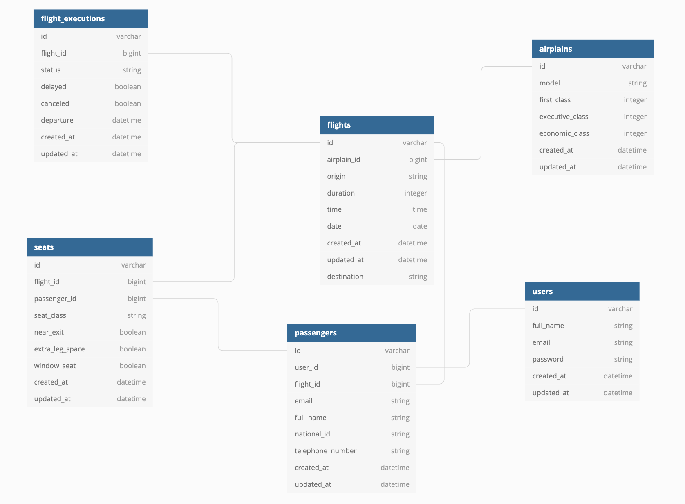

# Airport Project

(This is Back-End Api that handles airport flights with seat reservation)

## Entity Relationship Diagram



<br>
<br

### Built With

- [Ruby on rails]('#')
- [PostGres]('#')

## Here are the steps to run this Project

<!-- GETTING STARTED -->

## Getting Started

### Installation

1. Clone the repo

```sh
git clone git@github.com:TommyM0ntana/airplain-project.git
```

2. Bundle Install

```sh
bundle install
```

3. Create Database

```sh
rails db:create
```

4. Run the migrations

```sh
rails db:migrate
```

## POSTMAN SHARED COLLECTION WITH ALL THE API REQUESTS

[](https://god.postman.co/run-collection/f6049bc33f3d6eb34ce5)

## Airplain Routes

| Route                          | Description                                             |
| ------------------------------ | ------------------------------------------------------- |
| GET `/api/v1/airplains`        | Airplains index action, that shows all the airplains    |
| GET `/api/v1/airplains/:id`    | Airplains show action, that shows the single airplain   |
| POST `/api/v1/airplains`       | Airplains create action, that create the airplain       |
| UPDATE `/api/v1/airplains`     | Airplains update action, that update the airplain       |
| DELETE `/api/v1/airplains/:id` | Airplains destroy action, that delete the single flight |

## Flight Routes

| Route                        | Description                                                                                                                                                                                                      |
| ---------------------------- | ---------------------------------------------------------------------------------------------------------------------------------------------------------------------------------------------------------------- |
| GET `/api/v1/flights`        | Flights index action, that shows all the flights by ascending order,including the airplain informations, and can takes 3 different parameter to query by`(params[:origin], params[:destination], params[:date])` |
| GET `/api/v1/flight/:id`     | Flights show action, that shows the single flight                                                                                                                                                                |
| POST `/api/v1/flights`       | Flights create action, that create the flight, the flight execution and the seats                                                                                                                                |
| UPDATE `/api/v1/flights/:id` | Flights update, that update the flight                                                                                                                                                                           |
| DELETE `/api/v1/flight/:id`  | Flights destroy action, that delete the single flight                                                                                                                                                            |

## Passenger Routes

| Route                                                   | Description                                                                                                      |
| ------------------------------------------------------- | ---------------------------------------------------------------------------------------------------------------- |
| GET `/api/v1/passengers`                                | Passenger index action, that shows all the passengers and it can takes parameter to query by`(params[:user_id])` |
| GET `/api/v1/passenger/:id`                             | Passenger show action, that shows the single passenger                                                           |
| POST `/api/v1/passengers/:id/book_flight_seat/:seat_id` | Passenger action, that book a flight seat for the passenger                                                      |
| POST `/api/v1/passengers`                               | Passenger create action, that create the passenger                                                               |
| UPDATE `/api/v1/passengers/:id`                         | Passenger update, that update the passenger                                                                      |
| DELETE `/api/v1/passenger/:id`                          | Passenger destroy action, that delete the single passenger                                                       |

## Seat Routes

| Route                      | Description                                                                                                                                                                     |
| -------------------------- | ------------------------------------------------------------------------------------------------------------------------------------------------------------------------------- |
| GET `/api/v1/seats`        | Seat index action, that shows all the seats(and if is reserved or empty and also includes the flight informations) and it can takes parameter to query by`(params[:flight_id])` |
| GET `/api/v1/seat/:id`     | Seat show action, that shows the single seat                                                                                                                                    |
| POST `/api/v1/seats`       | Seat create action, that create the seat, the flight execution and the seats                                                                                                    |
| UPDATE `/api/v1/seats/:id` | Seat update, that update the seat                                                                                                                                               |
| DELETE `/api/v1/seat/:id`  | Seat destroy action, that delete the single seat                                                                                                                                |

## User Routes

| Route                      | Description                                      |
| -------------------------- | ------------------------------------------------ |
| GET `/api/v1/users`        | User index action, that shows all the users      |
| GET `/api/v1/user/:id`     | User show action, that shows the single user     |
| POST `/api/v1/users`       | User create action, that create the user         |
| UPDATE `/api/v1/users/:id` | User update, that update the user                |
| DELETE `/api/v1/user/:id`  | User destroy action, that delete the single user |

## Contributing

Contributions are what make the open source community such an amazing place to be learn, inspire, and create. Any contributions you make are **greatly appreciated**.

1. Fork the Project
2. Create your Feature Branch (`git checkout -b feature/AmazingFeature`)
3. Commit your Changes (`git commit -m 'Add some AmazingFeature'`)
4. Push to the Branch (`git push origin feature/AmazingFeature`)
5. Open a Pull Request
